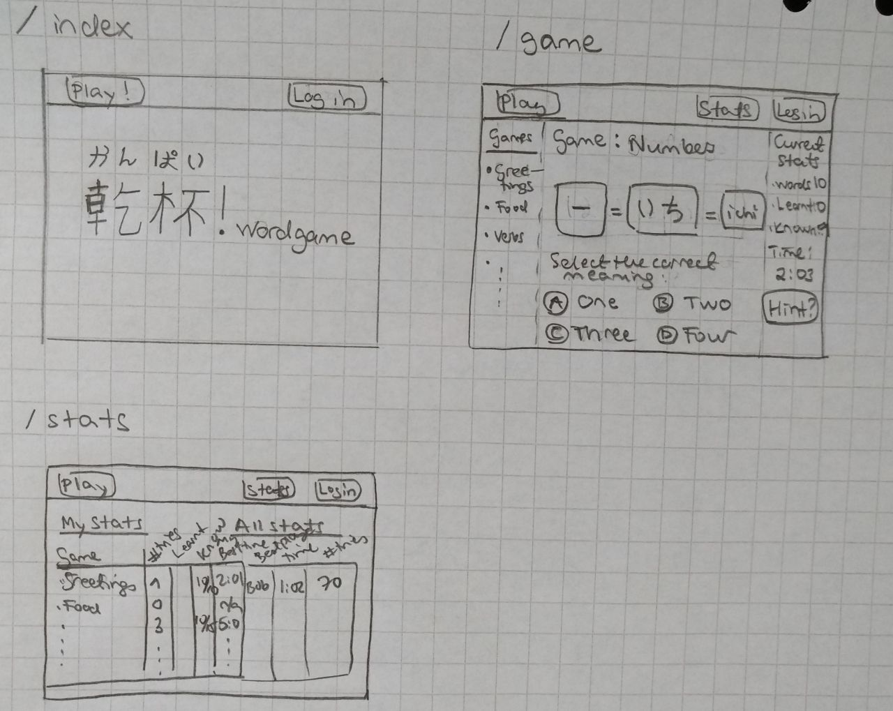

# 乾杯 かんぱい - Kanpai! wordgame

## Application Purpose

Purpose of the **乾杯 かんぱい - Kanpai wordgame** is to learn to read top  Japanese words in a fun and interactive way. The game covers most common Japanese words for e.g. greetings, food, and verbs.

Japanese uses three different syllabary - kanji, hiragana, and katakana (and in some cases the Latin script (known as roomaji)). The words are presented in all these versions, depending on which version is used in real life.

The game is a modified version of the standard word game, and assumes that the players do not necessarily have previous knowledge in Japanese. The player is presented with the different readings of the word and he/she needs to select the correct translation in English (or vice versa).

## User Groups

There are two types of roles in the application, a normal user, i.e. the player, and an admin user.

## User Interface Draft

Below is the first draft of the user interface

 

## Basic Version Functionalities

* User can create a new player, and log in and out as a player or as an admin user. (DONE)
* User can select which type of words to learn, e.g. greetings, numbers, months, adjectives, verbs, or food. (DONE)
* User will see different writings in Japanese for a particular word, and select which of the shown translations in English is the correct one. (DONE)
* User sees their statistics for the particular game (number of words to learn, number words learnt, time spent on the game). (WIP; times yet to be done)
* User sees statistics for their games over time (games player, number of words learn, best time in solving a particular game). (WIP; times yet to be done)
* User sees statistics for other players in the game (e.g. best times to solve particular games, best players in the game), contrasted with their own statistics. (Note: As in the beginning there are no other players in the game, there may be "imaginary" players in overall statistics). (WIP; times yet to be done)
* There are tips/hints to help the learning process. (DONE)
* User can give feedback on the game and see the feedbacks given by others. (DONE)
* Error messages are shown on the same page where relevant. (N/A)
* Admin user can review all feedbacks, answer to them, and delete feedbacks (hide from view). (WIP)

## Future Development Ideas
* User sees a word in English and selects the correct Japanese translation. 
* Statistics are presented in a visually pleasing manner.

## Release and testing

The application is available for testing in [Heroku](https://kanpaiwordgame.herokuapp.com/).

Updated 20.8.2021