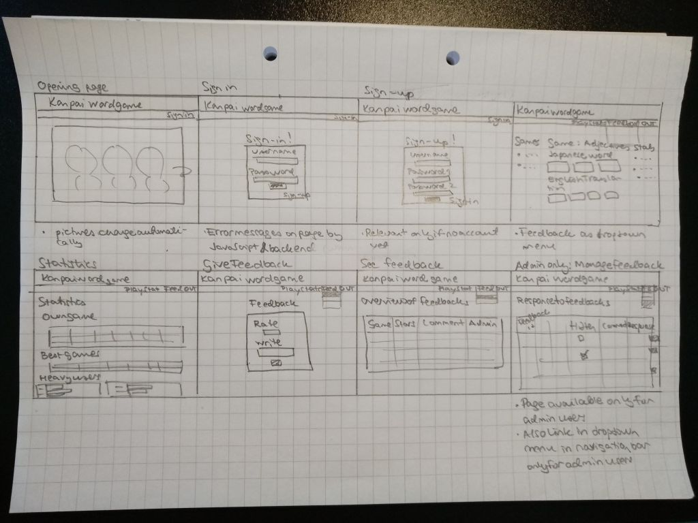

# 乾杯 かんぱい - Kanpai! wordgame

## Application Purpose

Purpose of the **乾杯 かんぱい - Kanpai wordgame** is to learn to read top  Japanese words in a fun and interactive way. The game covers most common Japanese words for e.g. greetings, food, and verbs.

Japanese uses three different syllabary - kanji, hiragana, and katakana (and in some cases the Latin script (known as roomaji)). The words are presented in all these versions, depending on which version is used in real life.

The game is a modified version of the standard word game, and assumes that the players do not necessarily have previous knowledge in Japanese. The player is presented with the different readings of the word and he/she needs to select the correct translation in English (or vice versa).

## User Groups

There is only one type of role in the application, normal user, i.e. the player.

## User Interface Draft

Below is the first draft of the user interface

 

## Basic Version Functionalities

* User can create a new player, and log in and out as a player. (DONE)
* User can select which type of words to learn, e.g. greetings, numbers, months, adjectives, verbs, or food. (WIP)
* User will see different writings in Japanese for a particular word, and select which of the shown translations in English is the correct one. (WIP)
* There are tips/hints to help the learning process. (N/A)
* User sees their statistics for the particular game (number of words to learn, number words learnt, time spent on the game). (N/A)
* User sees statistics for their games over time (games player, number of words learn, best time in solving a particular game). (NA)
* User sees statistics for other players in the game (e.g. best times to solve particular games, best players in the game), contrasted with their own statistics. (Note: As in the beginning there are no other players in the game, there will be "imaginary" players in overall statistics). (N/A)

## Future Development Ideas
* User sees a word in English and selects the correct Japanese translation. 
* User can give feedback on the game. 
* Statistics are presented in a visually pleasing manner. 

## Release and testing

The application is available for testing in [Heroku](https://kanpaiwordgame.herokuapp.com/).

Updated 1.8.2021